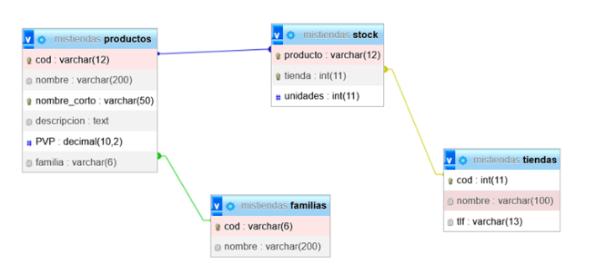
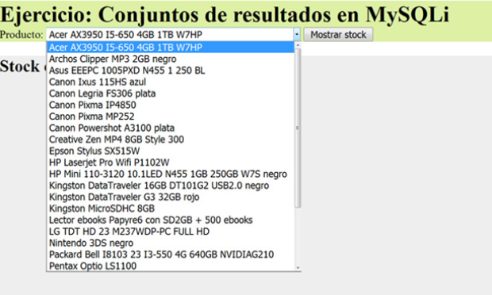
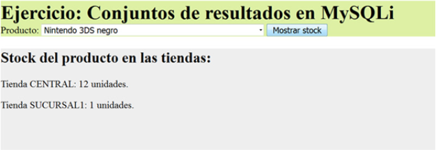

# Tienda 1

Utiliza el script que se proporciona para crear la base de datos `mistiendas`.

1. Crea un usuario llamado `admin` con contraseña `admin123`.
2. Añade las tablas e inserta los datos de ejemplo.



## Instrucciones

Basándote en las explicaciones sobre la librería `mysqli`, realiza un programa que:
1. Seleccione todos los productos de la base de datos.
2. Los muestre mediante un desplegable.

### Figura 1: Desplegable con productos



---

Cuando se elija uno de los productos, imprimirá en pantalla el número de unidades de ese producto en cada una de las tiendas.

### Figura 2: Resultados por tienda



---

Recuerda que tendremos que hacer alguna consulta más compleja para obtener los valores. Por ejemplo:

```sql
SELECT tiendas.nombre, stock.unidades 
FROM tiendas 
INNER JOIN stock ON tiendas.cod = stock.tienda 
WHERE stock.producto = '$producto';
